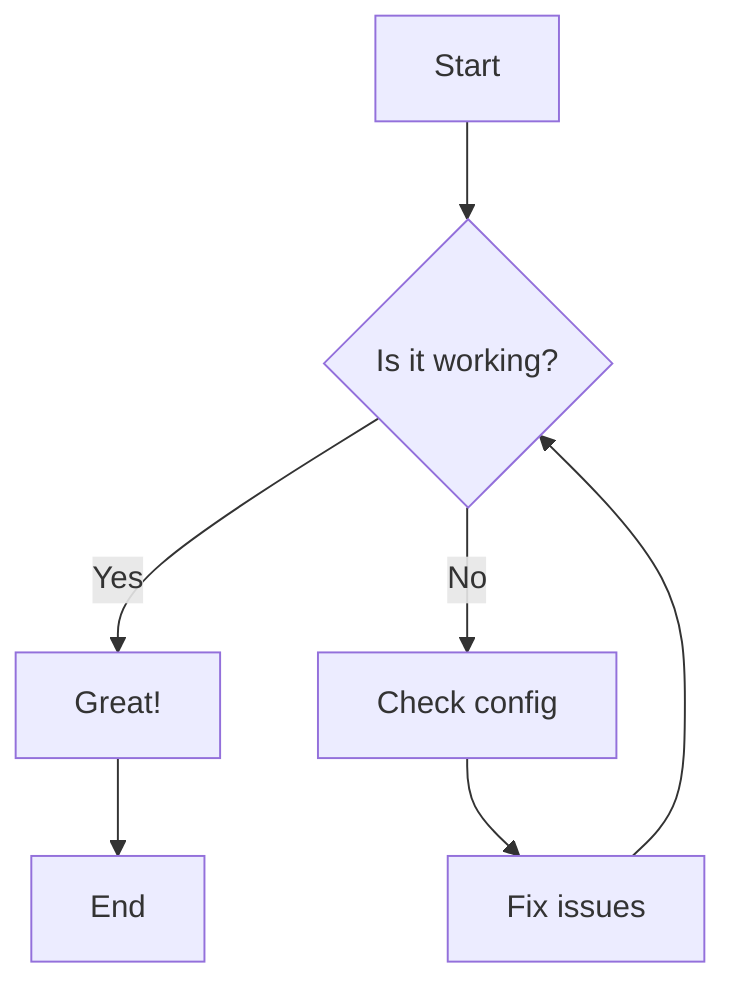
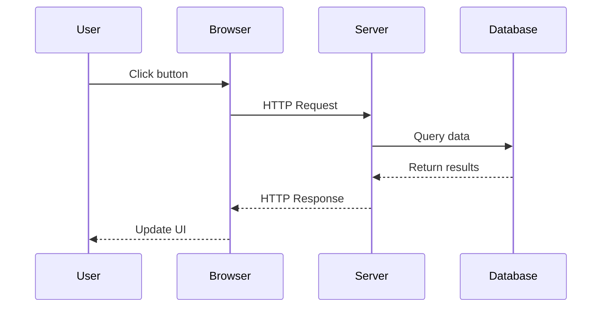
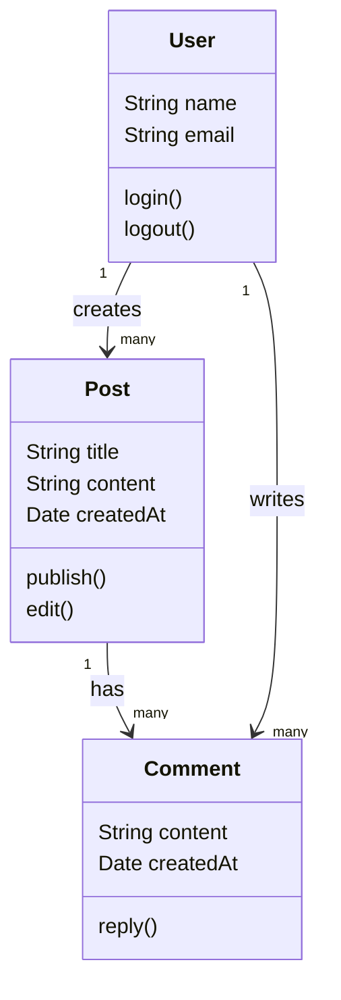
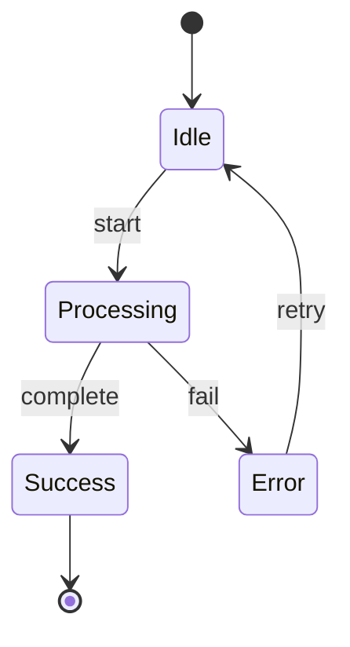
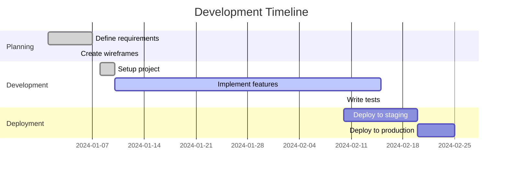
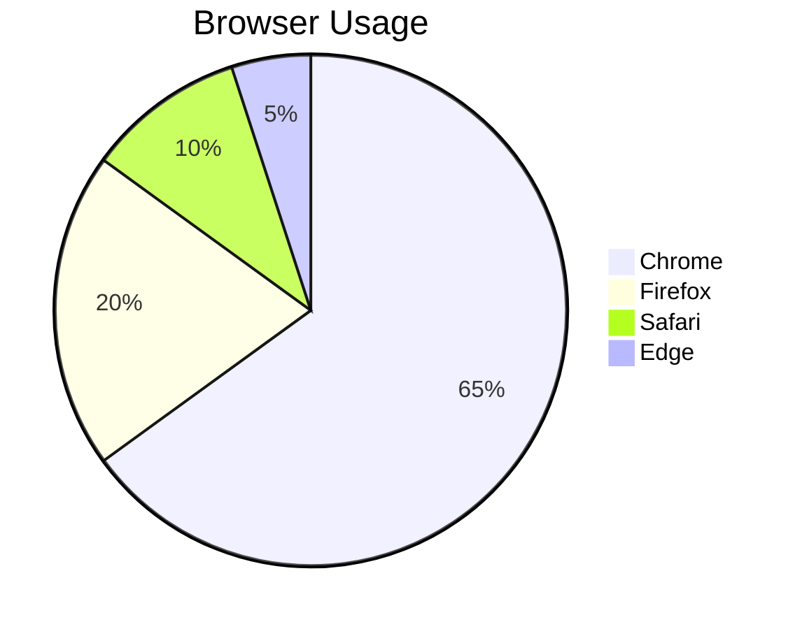
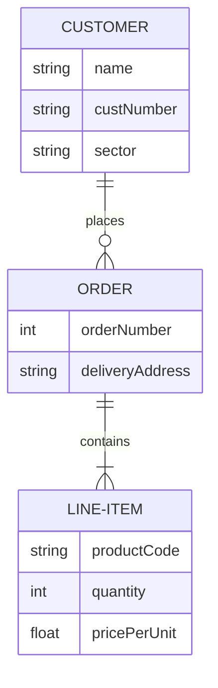
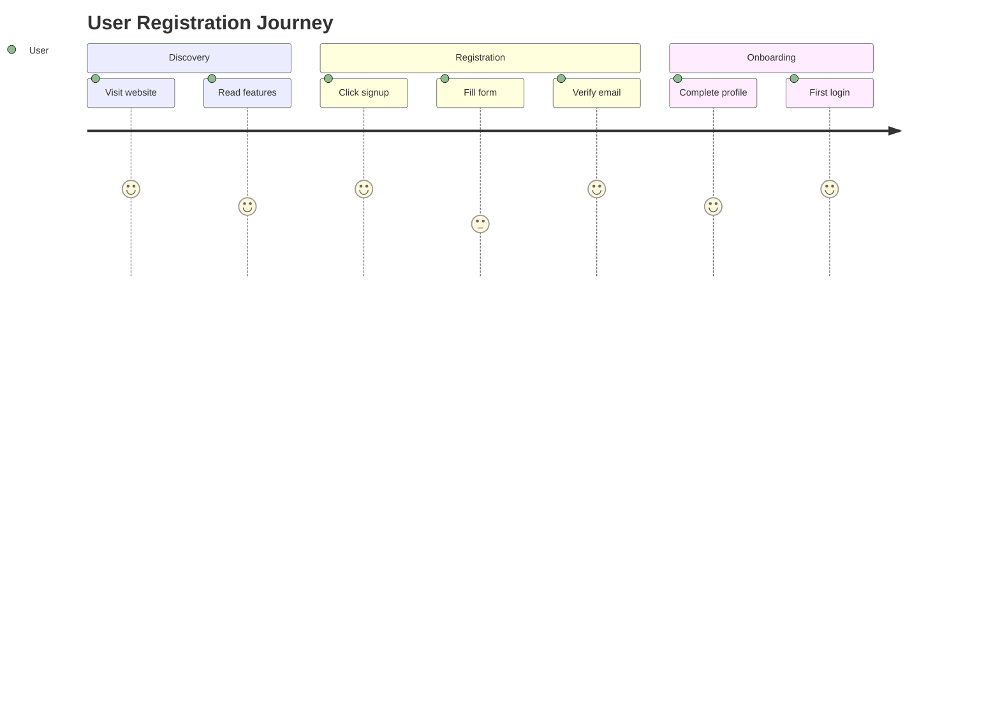
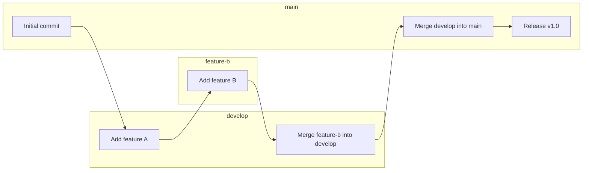

# Mermaid Diagrams in CodeScrolls

This page demonstrates the Mermaid diagram support in CodeScrolls documentation.

## Flowchart

## Sequence Diagram

## Class Diagram

## State Diagram

## Gantt Chart

## Pie Chart

## Entity Relationship Diagram

## User Journey

## Git Graph

